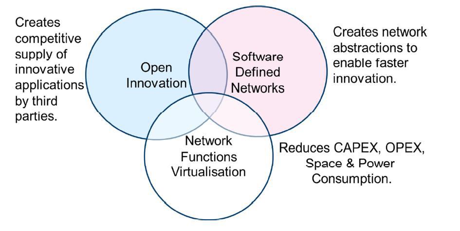
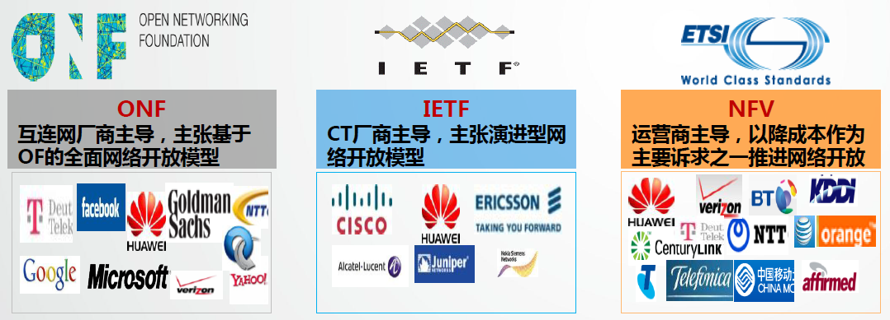

SDN资源
===========

###### 发展
1. 开放网络分布势力

2. 开放网络支持的团队

###### SDN三要素

1. vswitch
(router, switch)
2. openflow protocol
3. control panel
  + [开源的controller panel](http://www.sdnap.com/sdnap-post/485.html)
  + NOX
  + POX
  + Beacon
  + Floodlight
  + Trema
  + Ryu
  + Maestro
  + Jaxon
  + OVS-controller
  + Open Daylight
  + Open Contrail
  + NSX
  + cisco ACI
  + Cyaninc

###### 企业SDN
1. HW-SDN.pdf

###### SDN论文
1. 基于OpenFlow的SDN技术_左青云_陈鸣_赵广松_邢长友_张国敏_蒋培成.pdf

###### SDN 资料
1. 开源组织：[ONF](https://www.opennetworking.org/)
2. 国内组织：[sdnap](http://www.sdnap.com/sdn-guide)
3. 大学竞赛：http://www.scut.edu.cn/sdn/

